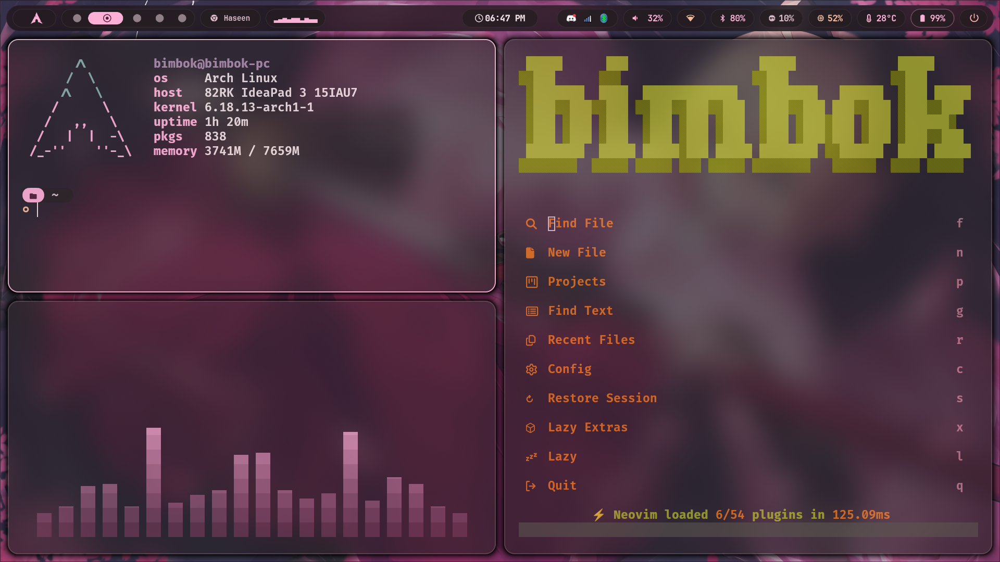
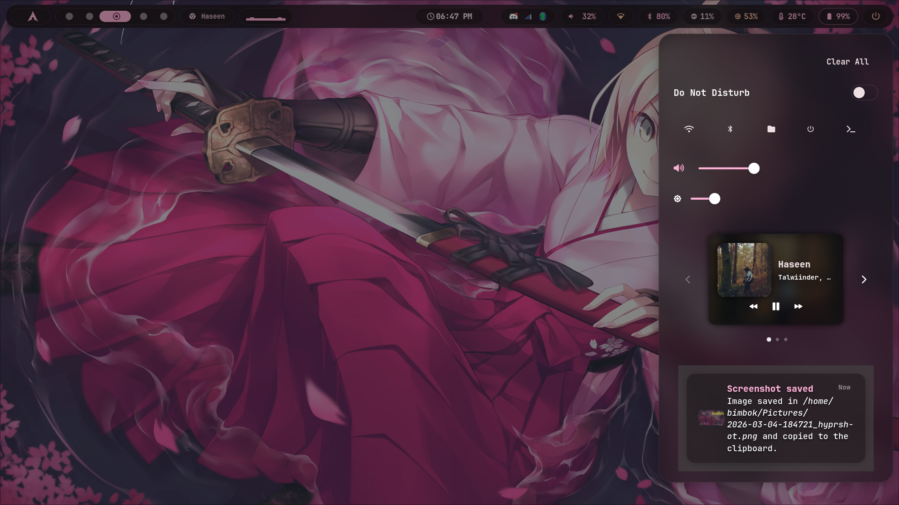
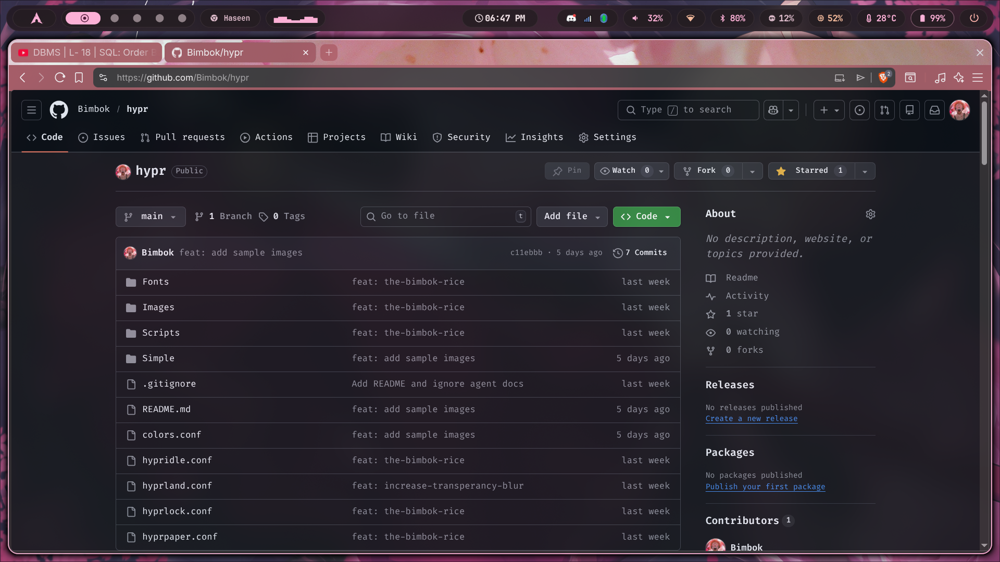

# Hyprland Config

A polished Hyprland configuration focused on a clean desktop, smooth animations, and a cohesive aesthetic. It combines subtle transparency/blur, consistent colors, and a curated set of scripts and services to deliver a refined daily-driver experience.

## Highlights

- Cohesive theme: centralized colors in `colors.conf` and consistent use across configs.
- Smooth visuals: rounded corners, blur, and animations tuned for a soft, modern look.
- Practical UX: sensible gaps/borders, fast app launching, and useful status/notification tooling.
- Lightweight automation: small Bash scripts for battery notifications and music metadata.

## Project Structure

- Core configs: `hyprland.conf`, `hypridle.conf`, `hyprlock.conf`, `hyprpaper.conf`, `colors.conf`.
- Scripts: `Scripts/` (`battery_notify.sh`, `music-status.sh`).
- Assets: `Images/` and `Fonts/` for lockscreen and UI visuals.

## Requirements

These are referenced directly in the configs or scripts:

- Hyprland
- waybar
- hypridle
- hyprlock
- hyprpaper or `swww-daemon`
- swaync
- swayosd
- rofi
- kitty
- nautilus
- playerctl (music script)
- notify-send (battery script; typically `libnotify`)

## Setup

1. Place this repo at `~/.config/hypr`.
2. Ensure required packages are installed.
3. Reload Hyprland:
   ```sh
   hyprctl reload
   ```

## Usage

- Rofi menu: `rofi -show drun` (configured as `$menu`).
- Reload config after edits:
  ```sh
  hyprctl reload
  ```
- Run scripts manually for testing:
  ```sh
  bash Scripts/battery_notify.sh
  bash Scripts/music-status.sh --title
  ```

## Customization

- Colors: edit `colors.conf` and reload.
- Autostart: adjust the `exec-once` lines in `hyprland.conf`.
- Wallpaper: update your wallpaper script or `hyprpaper.conf` as preferred.
- Music art fallback: edit `DEFAULT_ART` in `Scripts/music-status.sh`.

## Notes

- The config assumes a sensible Wayland stack and may reference local paths. Update them if your layout differs.
- Layer rules rely on namespaces from `hyprctl layers`. If effects don’t apply, verify the namespace names.
- [Waybar config repo](https://github.com/Bimbok/waybar.git)
- [Wlogout config repo](https://github.com/Bimbok/wlogout.git)

## Screenshots

Sample shots from `Simple/`:




[Hyprland sample 5](Simple/2026-03-08-082216_hyprshot.png)

## License

Personal configuration; reuse and modify freely.
